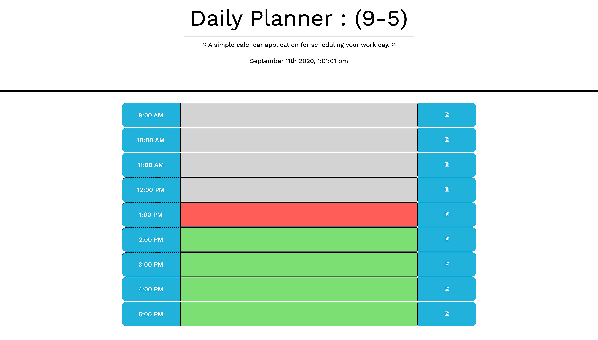

# Daily Planner (9-5):
## A simple calendar application for scheduling your work day. 

&nbsp;

### Project Description:

&nbsp;
This is a simple daily work day scheduler. This application is a single page interface and allows a user to enter some notes on an hourly time block. The user can store their events between the hours of 9am-5pm. The information can be stored by hitting the save button to the right after entry. The application utilizes local storage to store the notes even after the page is refreshed, or the user navigates away from the page. It also utilizes a color time block concept which considers the past(grey), present(red), and future(green) events. There is also a live clock at the top of the page that is accurate to the second. Current time is being routed via http://moment.js which is freely distributable under the terms of the MIT license.  This scheduling application was constructed using a single HTML file, a JavaScript file, and a CSS file. A schedule/clock favicon was generated via favic-o-matic. I utilized the Bootstrap CDN for some elements, jQuery CDN, FontAwesome for icons and worked with a contemporary font named "Work Sans" that was obtained through google fonts and designed by Wei Huang, a type designer from Australia. 

&nbsp;

&nbsp;

-------------------